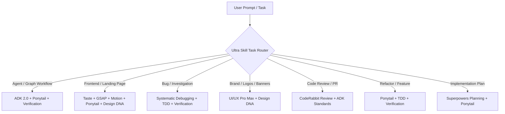

# ⚡ Ultra Skill — The All-in-One AI Powerhouse

> **One skill to rule them all.** Unifying 10 elite AI agent skills into a single, cohesive engine for AI Agent & Graph Architecture (Google ADK 2.0), Lazy-Efficient Engineering (Ponytail), Anti-Slop Frontend Design (Taste), Animation Engines (GSAP & Motion Design), Visual Identity Extraction (Design DNA), Rigorous Engineering Discipline (Systematic Debugging, TDD, Verification), Production Brand Assets (UI/UX Pro Max), and AI-Powered Code Reviews (CodeRabbit).

[](file:///d:/Agent%20SKILLS/ultra-skill/skills/ultra-skill/SKILL.md)
[](file:///d:/Agent%20SKILLS/ultra-skill/README.md)
[](file:///d:/Agent%20SKILLS/ultra-skill)
[](file:///d:/Agent%20SKILLS/ultra-skill/skills/ultra-skill/references/adk)

---

## 📑 Table of Contents

- [Overview & The Unified Vision](#-overview--the-unified-vision)
- [The 10 Unified Modules Matrix](#-the-10-unified-modules-matrix)
- [Automatic Task Routing](#-automatic-task-routing)
- [Core Feature Deep Dive](#-core-feature-deep-dive)
  - [1. AI Agent & Graph Workflow Engineering (ADK 2.0)](#1-ai-agent--graph-workflow-engineering-adk-20)
  - [2. Lazy-Efficient Coding (Ponytail)](#2-lazy-efficient-coding-ponytail)
  - [3. Anti-Slop Frontend Design (Taste)](#3-anti-slop-frontend-design-taste)
  - [4. Professional Animation Engines (GSAP & Motion Design)](#4-professional-animation-engines-gsap--motion-design)
  - [5. Visual Identity Extraction & Generation (Design DNA)](#5-visual-identity-extraction--generation-design-dna)
  - [6. Brand Assets & Design Production (UI/UX Pro Max)](#6-brand-assets--design-production-uiux-pro-max)
  - [7. Systematic Debugging & Root Cause Analysis](#7-systematic-debugging--root-cause-analysis)
  - [8. Test-Driven Development (TDD)](#8-test-driven-development-tdd)
  - [9. Verification Before Completion](#9-verification-before-completion)
  - [10. Autonomous Code Review](#10-autonomous-code-review)
  - [11. Architecture & Implementation Planning](#11-architecture--implementation-planning)
- [Directory & Repository Structure](#-directory--repository-structure)
- [Installation & Multi-Platform Setup](#-installation--multi-platform-setup)
  - [For Google Antigravity & Gemini CLI](#for-google-antigravity--gemini-cli)
  - [For Claude Code](#for-claude-code)
  - [For Cursor, Windsurf, OpenCode & Other AI IDEs](#for-cursor-windsurf-opencode--other-ai-ides)
- [Pre-Flight Quality Checklist](#-pre-flight-quality-checklist)
- [Cookbook & Real-World Recipes](#-cookbook--real-world-recipes)
- [License & Sources](#-license--sources)

---

## 🌟 Overview & The Unified Vision

Modern AI agent workflows suffer from **fragmentation and tool sprawl**:
- You load one skill for writing tests, but it creates bloated boilerplate code.
- You ask an agent to build a landing page, and it generates generic "AI slop" with purple gradients, standard Inter typography, and three identical cards.
- You design animations, but they end up linear, laggy, or inaccessible.
- You orchestrate agent systems with fragile monolithic prompts instead of deterministic state graphs.

**Ultra Skill** solves this by consolidating the top open-source agent patterns and domain skills into an orchestrated, self-routing mega-skill. With Ultra Skill active, an AI assistant behaves like an elite principal engineer and creative director: ruthless on code simplicity, uncompromising on visual aesthetics, structured in multi-agent orchestration, and disciplined in debugging and verification.

---

## 🧩 The 10 Unified Modules Matrix

Ultra Skill merges 10 battle-tested repositories and skills:

| Module / Skill | Provenance / Upstream | Primary Superpower & Contribution |
| :--- | :--- | :--- |
| **§1 Ponytail** | [`DietrichGebert/ponytail`](https://github.com/DietrichGebert/ponytail) | **Lazy-Efficient Engineering:** Minimal code, YAGNI, standard library first, shortest diff wins. |
| **§2 Taste** | [`Leonxlnx/taste-skill`](https://github.com/Leonxlnx/taste-skill) | **Anti-Slop Frontend Design:** Brief inference, 3 dials (Variance/Motion/Density), typography & color locks. |
| **§3 GSAP Mastery** | [`greensock/gsap-skills`](https://github.com/greensock/gsap-skills) | **Professional Animation:** High-performance sequencing, ScrollTrigger, transform aliases, responsive timelines. |
| **§4 Motion Design** | [`LottieFiles/motion-design-skill`](https://github.com/LottieFiles/motion-design-skill) | **Emotion-Driven Choreography:** 3 motion layers (primary/secondary/ambient), micro-interaction timings. |
| **§5 Design DNA** | [`zanwei/design-dna`](https://github.com/zanwei/design-dna) | **Visual Identity Pipeline:** Extract, quantize, and apply design systems and WebGL/Canvas effects from URLs/images. |
| **§6 Systematic Debugging** | [`obra/superpowers`](https://github.com/obra/superpowers) | **Root Cause Investigation:** 4-phase investigation protocol, hypothesis testing, 3-fix circuit breaker. |
| **§7 TDD** | [`obra/superpowers`](https://github.com/obra/superpowers) | **Ironclad TDD Discipline:** Red-Green-Refactor; no production code without a verified failing test first. |
| **§8 Verification** | [`obra/superpowers`](https://github.com/obra/superpowers) | **Gate-Function Verification:** Fresh command execution evidence before any claim of completion is made. |
| **§9 UI/UX Pro Max** | [`nextlevelbuilder/ui-ux-pro-max-skill`](https://github.com/nextlevelbuilder/ui-ux-pro-max-skill) | **Brand & Production Assets:** 55+ logo styles, CIP for 20 industries, social banners, 3-tier token architecture. |
| **§10 Code Review** | [`coderabbitai/skills`](https://github.com/coderabbitai/skills) | **Autonomous Review & Triage:** Severity-rated findings (Critical → Info), secret hygiene, automated review loop. |
| **§11 Implementation Planning** | [`obra/superpowers`](https://github.com/obra/superpowers) | **Zero-Context Engineering Plans:** Exact file paths, precise method signatures, atomic TDD task steps. |
| **§14-17 Google ADK 2.0** | [`google/adk-python`](https://github.com/google/adk-python) | **Enterprise Agent & Graph Workflows:** Directed graph scheduling, fan-out/fan-in, dynamic nodes, HITL, headless diagnostics. |

---

## 🧭 Automatic Task Routing

You don't need to manually invoke sub-skills. Ultra Skill detects the intent and automatically activates the proper modules in synergy:



### Module Activation Routing Table

| Task Category | Active Modules | Synergy Benefit |
| :--- | :--- | :--- |
| **Building AI agents / graphs / pipelines** | §14 ADK Agent & Workflows + §1 Ponytail + §8 Verification | Deterministic graphs without bloated prompt chains. |
| **Multi-agent orchestration / HITL** | §14 ADK Workflows + §15 ADK Architecture | Interrupt-safe workflows with human review checkpoints. |
| **Agent diagnostics & trace inspection** | §16 ADK Debugging (`--jsonl`) + §6 Systematic Debugging | Headless event triage without spinning up unnecessary servers. |
| **Frontend landing page / portfolio** | §2 Taste + §3 GSAP + §4 Motion + §5 Design DNA | Anti-slop aesthetics, custom fonts, 60fps choreographed motion. |
| **Bug fixing / production incidents** | §6 Systematic Debugging + §7 TDD + §8 Verification | Guarantees root-cause resolution with a regression test. |
| **New feature implementation** | §1 Ponytail + §7 TDD + §8 Verification | Clean, minimal diffs with 100% test proof. |
| **Architecture / Feature planning** | §11 Writing Plans + §1 Ponytail | Executable blueprint designed for any engineer to ship. |
| **Brand identity / slides / assets** | §9 UI/UX Pro Max + §5 Design DNA | Production-ready logos, banner dimensions, and design tokens. |
| **PR & Code Review** | §10 Code Review + §17 Production Standards | Strict severity classification and security secret scanning. |
| **All tasks upon completion** | **§8 Verification Before Completion (MANDATORY)** | Zero hallucinations; evidence provided before completion claims. |

---

## 🔬 Core Feature Deep Dive

### 1. AI Agent & Graph Workflow Engineering (ADK 2.0)
*(Powered by Google ADK 2.0 / `google/adk-python`)*

Ultra Skill applies strict software engineering standards to AI agents, replacing fragile prompt chains with deterministic graph workflows.

- **Canonical Public Imports:**
  ```python
  from google.adk import Agent, Workflow, Context, Event
  from google.adk.workflow import JoinNode, node
  from google.adk.runners import InMemoryRunner
  ```
- **Standard Convention Directory Structure:**
  ```text
  my_agent/
  ├── __init__.py       # REQUIRED: must expose `from . import agent`
  ├── agent.py          # REQUIRED: defines `root_agent`
  └── .env              # Local API keys (placed directly in agent dir)
  ```
- **Graph Workflows & Edge Compilation:** Connect deterministic nodes from `"START"` through branching logic:
  ```python
  root_agent = Workflow(
      name="triage_workflow",
      edges=[
          ("START", classify_input),
          (classify_input, {"urgent": handle_urgent, "standard": handle_standard}),
      ],
  )
  ```
- **Function Nodes & `@node` Decorators:**
  - `parallel_worker=True`: Automatically processes input collections concurrently across workers.
  - `rerun_on_resume=True`: Guarantees re-execution when resuming an interrupted workflow (essential for dynamic loopers).
- **Fan-Out / Fan-In Parallelism:** Execute concurrent tasks simultaneously and aggregate them with `JoinNode`:
  ```python
  join_step = JoinNode(name="aggregate_results")
  root_agent = Workflow(
      name="parallel_research",
      edges=[("START", (fetch_web, fetch_db, fetch_docs), join_step, synthesize_node)],
  )
  ```
- **Dynamic Scheduling:** Programmatically dispatch nodes at runtime with `await ctx.run_node(agent, node_input=...)`.
- **Human-in-the-Loop (HITL) Interrupts:** Pause execution for user confirmation with `RequestInput(prompt="...", interrupt_id="...")`. When resumed, ADK fast-forwards through already completed steps without re-triggering side effects.
- **Headless CLI Diagnostics:**
  ```bash
  # Triage agent events in real-time via JSONL
  adk run --jsonl my_agent "Query" | jq 'select(.event_type == "tool_call")'
  ```
- **In-Memory Automated Unit Testing:** Test agents deterministically with `InMemoryRunner` without external browser dependencies.
- **11 Embedded Deep Reference Manuals:** Bundled inside `skills/ultra-skill/references/adk/`:
  - `adk-agent-builder`, `adk-architecture`, `adk-debug`, `adk-git`, `adk-review`, `adk-sample-creator`, `adk-setup`, `adk-style`, `adk-unit-design`, `adk-unit-guide`, `adk-verify-snippets`.

---

### 2. Lazy-Efficient Coding (Ponytail)
*(Powered by `DietrichGebert/ponytail`)*

> *"The best code is the code never written. Shortest working diff wins."*

Ultra Skill adheres to the **Lazy Senior Developer Ladder** — evaluate every task top-to-bottom and stop at the first rung that satisfies the requirement:

1. **Does this need to exist at all?** (YAGNI — reject speculative features).
2. **Is it already in this codebase?** (Reuse existing utilities, types, and components).
3. **Does the standard library do it?** (Avoid external bloat).
4. **Does a native platform feature cover it?** (`<input type="date">` over heavy JS pickers; CSS over JS; DB constraints over app validations).
5. **Does an already-installed package solve it?** (Never install a new package for 10 lines of logic).
6. **Can it be written in one clear line?** (Write that line).
7. **Only then:** Write the minimum necessary code.

#### Key Principles:
- **No Unrequested Abstractions:** No single-implementation interfaces, no speculative factories.
- **Root-Cause Fixes:** Patch bugs where all callers funnel through, not by masking symptoms.
- **`# ponytail:` Annotations:** Explicitly comment on simplifications and delineate their upgrade triggers.
- **Non-Negotiables:** Never simplify security, input boundaries, accessibility, or data loss protections.

---

### 3. Anti-Slop Frontend Design (Taste)
*(Powered by `Leonxlnx/taste-skill`)*

Ultra Skill completely eliminates generic AI slop from web apps and landing pages.

#### Brief Inference & "The Design Read"
Before writing HTML or CSS, Ultra Skill infers the project's true intent:
- **Page Kind:** Landing page, personal portfolio, editorial, B2B SaaS.
- **Vibe Language:** Minimalist, brutalist, luxury/premium, playful, technical.
- **Target Audience:** Consumer, enterprise buyers, recruiters.
- **Explicit Declaration:** Outputs a one-sentence *Design Read* before implementing.

#### The Three Dials
Every interface is calibrated along three numeric axes (1–10):
- `DESIGN_VARIANCE` (Default: 8) — 1 (Pure Symmetry) to 10 (Controlled Asymmetry/Editorial Chaos).
- `MOTION_INTENSITY` (Default: 6) — 1 (Static) to 10 (Cinematic Choreography).
- `VISUAL_DENSITY` (Default: 4) — 1 (Airy/Spacious) to 10 (Dense/Information-Packed).

#### Hard Design Invariants:
- 🚫 **The Lila Rule:** No default purple/blue glowing cards or neon glows.
- 🚫 **No Default Inter / Roboto:** Use personality-driven typefaces (Geist, Outfit, Cabinet Grotesk, Satoshi).
- 🚫 **Ban on Generic Serifs:** Never insert random serif italic words into sans-serif headlines.
- 🚫 **Hero Viewport Lock:** The hero section MUST fit inside `min-h-[100dvh]` without scrolling. Headline ≤ 2 lines, CTA visible above fold.
- 🚫 **Logo Walls:** "Trusted by" strips belong *under* the hero, never inside the hero container.
- 🚫 **No Fake Screenshot Divs:** Use real images (AI-generated, Picsum seed assets, or Simple Icons SVGs).
- 🎨 **Color & Radius Consistency Lock:** Single accent color per page (saturation < 80%); uniform corner radius hierarchy throughout.

---

### 4. Professional Animation Engines (GSAP & Motion Design)
*(Powered by `greensock/gsap-skills` & `LottieFiles/motion-design-skill`)*

Motion must be motivated, believable, and performant.

#### GSAP Rules & Canonical Patterns
- **Transform Aliases Only:** Always animate `x`, `y`, `scale`, `rotation`, and `autoAlpha`. Never animate `top`, `left`, `width`, or `height`.
- **Responsive Animations:** Utilize `gsap.matchMedia()` for responsive layouts and `prefers-reduced-motion` compliance.
- **Blueprints:**
  - *Sticky-Stack:* Smooth card stacking on scroll via pinned ScrollTrigger.
  - *Horizontal-Pan:* Scrubbed horizontal timeline slider.
  - *Scroll-Reveal:* Motion `whileInView` for lightweight element reveals.

#### Emotion-Driven Choreography
- **The Three Motion Layers (Always Present):**
  1. *Primary Layer:* Main focal action (card enter, modal reveal).
  2. *Secondary Layer:* Accompanying richness (icon drift, shadow displacement).
  3. *Ambient Layer:* Environmental life (gentle gradient pulses, floating particles).
- **Motion Archetypes:**
  - *Playful:* 150–300ms, `ease-out-back`, 10–20% overshoot.
  - *Premium:* 350–600ms, `cubic-bezier(0.4, 0, 0.2, 1)`, 0% overshoot.
  - *Corporate:* 200–400ms, `cubic-bezier(0.2, 0, 0, 1)`, 0–3% overshoot.
  - *Energetic:* 100–250ms, `ease-out-expo`, 15–30% overshoot.
- **Accessibility:** `prefers-reduced-motion` media queries are mandatory for all `MOTION_INTENSITY > 3`.

---

### 5. Visual Identity Extraction & Generation (Design DNA)
*(Powered by `zanwei/design-dna`)*

Extract design language from reference screenshots or live URLs and convert them into tokenized design systems:

```text
[ Reference Screenshot / URL ]
             │
             ▼
┌──────────────────────────────────────────────┐
│ Phase 1: Structure (JSON Schema Definition)  │
└──────────────────────────────────────────────┘
             │
             ▼
┌──────────────────────────────────────────────┐
│ Phase 2: Analyze & Extract                   │
│ • Deterministic color quantization           │
│ • Typographic hierarchy & font pairing       │
│ • Spacing, elevation, & border tokens        │
└──────────────────────────────────────────────┘
             │
             ▼
┌──────────────────────────────────────────────┐
│ Phase 3: Tokenized Generation                │
│ • CSS Custom Properties (:root)              │
│ • Canvas / WebGL / Three.js Visual Effects   │
│ • Production-ready semantic markup           │
└──────────────────────────────────────────────┘
```

---

### 6. Brand Assets & Design Production (UI/UX Pro Max)
*(Powered by `nextlevelbuilder/ui-ux-pro-max-skill`)*

Generate professional marketing and corporate identity assets:
- **Logo Generation:** 55+ distinct aesthetic styles across 30 curated palettes.
- **Corporate Identity Packages (CIP):** Business cards, stationery, invoices, and brand books tailored to 20 specific industries.
- **HTML Slide Presentations:** Tokenized presentation slide decks featuring Chart.js integration.
- **Multi-Platform Ad & Social Banners:** Pre-calculated pixel-perfect dimensions:
  - *Twitter/X Header:* 1500 × 500
  - *LinkedIn Banner:* 1584 × 396
  - *YouTube Channel Art:* 2560 × 1440
  - *Instagram Post / Story:* 1080 × 1080 / 1080 × 1920
  - *Google Ads Med Rectangle:* 300 × 250
- **3-Tier Token Architecture:** `Primitive` (hex/values) → `Semantic` (intent) → `Component` (element specific).

---

### 7. Systematic Debugging & Root Cause Analysis
*(Powered by `obra/superpowers`)*

> [!CAUTION]
> **The Iron Law:** NO FIXES WITHOUT ROOT CAUSE INVESTIGATION FIRST.

Ultra Skill prohibits guessing, speculative tweaks, or applying fixes before discovering the root cause:
- **Phase 1: Root Cause Investigation:** Read complete error traces, isolate reproducible steps, inspect `git diff`, and trace data flow across service boundaries.
- **Phase 2: Pattern Analysis:** Locate working examples in the codebase and identify structural differences.
- **Phase 3: Hypothesis & Minimal Test:** Formulate a single testable hypothesis (`"I hypothesize X because Y"`). Test with one isolated variable change.
- **Phase 4: Implementation & The 3-Fix Circuit Breaker:** Implement a single surgical fix backed by a failing test. If 3 consecutive fix attempts fail, **halt execution immediately** to re-evaluate the architectural assumptions.

---

### 8. Test-Driven Development (TDD)
*(Powered by `obra/superpowers`)*

> [!IMPORTANT]
> **The Iron Law:** NO PRODUCTION CODE WITHOUT A FAILING TEST FIRST.

1. **RED:** Author an atomic, minimal failing test reflecting the requirement.
2. **Verify RED:** Run the test suite and confirm failure for the expected reason.
3. **GREEN:** Write the simplest possible implementation to make the test pass.
4. **Verify GREEN:** Confirm all tests pass with zero regressions.
5. **REFACTOR:** Clean up code, remove duplication, and preserve green tests.

---

### 9. Verification Before Completion
*(Powered by `obra/superpowers`)*

> [!WARNING]
> **The Iron Law:** NO COMPLETION CLAIMS WITHOUT FRESH VERIFICATION EVIDENCE.

Before stating that any task is finished, Ultra Skill executes the **5-Step Gate Function**:
1. **IDENTIFY:** Determine the exact terminal command that proves the claim.
2. **RUN:** Execute the command synchronously and freshly.
3. **READ:** Read the full stdout/stderr, check exit code (`0`), and verify zero failures.
4. **VERIFY:** Confirm the output matches all user requirements.
5. **ONLY THEN:** Announce completion.

Words such as *"should work"*, *"probably fixed"*, or *"seems fine"* are strictly prohibited.

---

### 10. Autonomous Code Review
*(Powered by `coderabbitai/skills`)*

- **Severity Classification:** Issues are triaged as `Critical`, `Major`, `Minor`, `Trivial`, or `Info`.
- **Security-First Analysis:** Scans for leaked credentials, API tokens, untrusted inputs, and injection vectors.
- **Autonomous Review Loop:** Generates diff → runs review → prioritizes Critical/Major issues → applies surgical fixes → verifies fixes with test suite.

---

### 11. Architecture & Implementation Planning
*(Powered by `obra/superpowers`)*

Plans are authored for an engineer who has never seen the codebase:
- Specifies exact target file paths, complete function signatures, and consumed/produced types.
- Breaks down features into atomic TDD tasks (Write failing test → Verify fail → Write code → Verify pass → Commit).
- Conducts a 5-point self-review: Spec coverage, single-action steps, naming consistency, edge-case test coverage, and concise scope.

---

## 📂 Directory & Repository Structure

The `ultra-skill` distribution is organized as follows:

```text
ultra-skill/
├── AGENTS.md                  # Universal agent behavior rules (active by default)
├── CLAUDE.md                  # Claude Code integration pointer
├── GEMINI.md                  # Gemini CLI integration pointer
├── README.md                  # This comprehensive guide
└── skills/
    └── ultra-skill/
        ├── SKILL.md           # Master skill definition & full instruction manual
        └── references/
            └── adk/           # Deep reference documentation for ADK 2.0
                ├── adk-agent-builder/      # Agent creation patterns & CLI rules
                ├── adk-architecture/       # Context/Event dual-channel runtime
                ├── adk-debug/              # CLI triage, logs, & JSONL inspection
                ├── adk-git/                # Commit and release workflows
                ├── adk-review/             # Code standards & static review rules
                ├── adk-sample-creator/     # Guidelines for reference agent samples
                ├── adk-setup/              # Installation, uv, and dependencies
                ├── adk-style/              # Python conventions & typing guides
                ├── adk-unit-design/        # Node contract & interface design
                ├── adk-unit-guide/         # Workflow graph development rules
                └── adk-verify-snippets/    # Code snippet verification harness
```

---

## 🚀 Installation & Multi-Platform Setup

### For Google Antigravity & Gemini CLI
To install as a local skill in your Antigravity or Gemini project:
```bash
# Windows PowerShell
New-Item -ItemType Directory -Force -Path "$HOME\.agents\skills"
Copy-Item -Recurse -Force "d:\Agent SKILLS\ultra-skill\skills\ultra-skill" "$HOME\.agents\skills\ultra-skill"
```
```bash
# macOS / Linux
mkdir -p ~/.agents/skills
cp -r "ultra-skill/skills/ultra-skill" ~/.agents/skills/
```

### For Claude Code
```bash
# Copy agent instruction pointers to your project root
cp ultra-skill/CLAUDE.md ultra-skill/AGENTS.md /path/to/my-project/

# Copy the skill into Claude's skill registry
mkdir -p /path/to/my-project/.claude/skills
cp -r ultra-skill/skills/ultra-skill /path/to/my-project/.claude/skills/
```

### For Cursor, Windsurf, OpenCode & Other AI IDEs
Simply add `AGENTS.md` to your workspace root or configure your agent to read `skills/ultra-skill/SKILL.md`. The instructions are completely self-contained and framework-agnostic.

---

## ✅ Pre-Flight Quality Checklist

Ultra Skill performs this verification audit before submitting any final response:

### 🤖 Agent & Workflow Tasks (ADK 2.0)
- [ ] Agent directory includes `__init__.py` exposing `from . import agent`?
- [ ] Primary agent or workflow exported as `root_agent`?
- [ ] Every tool parameter has strict type annotations and docstring explanations?
- [ ] Graph edges start at `"START"` and resolve to terminal outputs without loops?
- [ ] Fan-out nodes are converged with a `JoinNode`?
- [ ] Nodes using `ctx.run_node` are decorated with `@node(rerun_on_resume=True)`?
- [ ] Verified headlessly with `adk run --jsonl` or `InMemoryRunner`?

### 💻 Code & Refactoring Tasks
- [ ] Ponytail Ladder evaluated: Is this the shortest, simplest working diff?
- [ ] No unrequested abstractions, factories, or speculative scaffolding?
- [ ] TDD cycle followed (failing test written and verified before implementation)?
- [ ] Root cause identified and solved rather than masked?
- [ ] Deliberate simplifications documented with `# ponytail:`?

### 🎨 Frontend & Design Tasks
- [ ] Initial *Design Read* one-liner output before code was written?
- [ ] The Three Dials (`VARIANCE`, `MOTION`, `DENSITY`) explicitly set?
- [ ] Hero section strictly fits `min-h-[100dvh]` with CTA above fold?
- [ ] Single accent color and unified border radius used across the entire page?
- [ ] Color contrast passes WCAG AA (4.5:1 text, 3:1 display)?
- [ ] Zero AI clichés (no Inter default, no purple glow, no fake screenshot divs)?
- [ ] All motion has 3 layers and respects `prefers-reduced-motion`?

### 🛡️ Completion Verification (All Tasks)
- [ ] Actual terminal verification command executed?
- [ ] Output verified for zero errors and exit code `0`?
- [ ] Completion claims backed strictly by visible output logs?

---

## 🍳 Cookbook & Real-World Recipes

### Recipe 1: Building a Branching AI Agent Workflow
```python
from google.adk import Workflow, Event

def analyze_sentiment(text: str) -> Event:
    score = len(text) % 2  # Replace with actual model evaluation
    route = "positive" if score == 0 else "negative"
    return Event(output={"text": text, "route": route}, route=route)

def handle_positive(payload: dict) -> str:
    return f"Thank you for the kind feedback on: {payload['text']}"

def handle_negative(payload: dict) -> str:
    return f"Forwarded to support team: {payload['text']}"

root_agent = Workflow(
    name="feedback_triage",
    edges=[
        ("START", analyze_sentiment),
        (analyze_sentiment, {
            "positive": handle_positive,
            "negative": handle_negative,
        }),
    ],
)
```

### Recipe 2: 60fps Scroll-Triggered Animation with GSAP
```javascript
import gsap from "gsap";
import { ScrollTrigger } from "gsap/ScrollTrigger";

gsap.registerPlugin(ScrollTrigger);

const mm = gsap.matchMedia();

mm.add({
  isDesktop: "(min-width: 768px)",
  reduceMotion: "(prefers-reduced-motion: reduce)"
}, (context) => {
  const { isDesktop, reduceMotion } = context.conditions;

  if (reduceMotion) {
    gsap.set(".feature-card", { autoAlpha: 1 });
    return;
  }

  gsap.from(".feature-card", {
    scrollTrigger: {
      trigger: ".features-grid",
      start: "top 80%",
      toggleActions: "play none none reverse",
    },
    y: isDesktop ? 40 : 20,
    autoAlpha: 0,
    duration: 0.6,
    stagger: 0.15,
    ease: "power2.out",
  });
});
```

---

## 📄 License & Sources

Released under the [MIT License](file:///d:/Agent%20SKILLS/ultra-skill/README.md).

### Upstream Sources & Credits
- **Google ADK 2.0:** [`google/adk-python`](https://github.com/google/adk-python)
- **Ponytail:** [`DietrichGebert/ponytail`](https://github.com/DietrichGebert/ponytail)
- **Taste:** [`Leonxlnx/taste-skill`](https://github.com/Leonxlnx/taste-skill)
- **GSAP Skills:** [`greensock/gsap-skills`](https://github.com/greensock/gsap-skills)
- **Motion Design:** [`LottieFiles/motion-design-skill`](https://github.com/LottieFiles/motion-design-skill)
- **Design DNA:** [`zanwei/design-dna`](https://github.com/zanwei/design-dna)
- **Superpowers:** [`obra/superpowers`](https://github.com/obra/superpowers)
- **CodeRabbit Skills:** [`coderabbitai/skills`](https://github.com/coderabbitai/skills)
- **Vercel Skills:** [`vercel-labs/skills`](https://github.com/vercel-labs/skills)
- **UI/UX Pro Max:** [`nextlevelbuilder/ui-ux-pro-max-skill`](https://github.com/nextlevelbuilder/ui-ux-pro-max-skill)

---

*Engineered with precision for autonomous AI agents and pair-programming engineers.*
