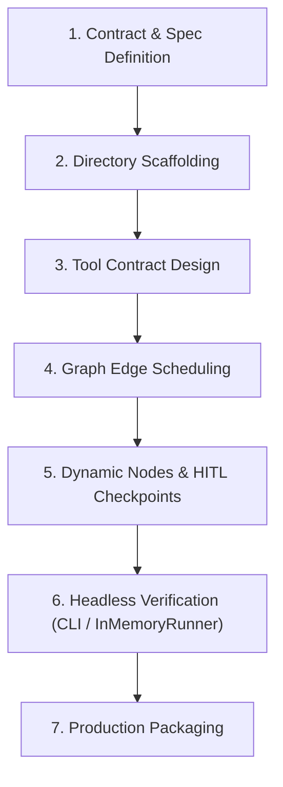

# 🔄 Agentic Workflow 01: ADK 2.0 Graph & Multi-Agent Orchestration

> **Purpose:** Build deterministic, production-grade AI agent systems using Google ADK 2.0 graph workflows, dynamic nodes, human-in-the-loop pauses, and headless testing.

---

## 📋 Prerequisites
- Python 3.10+ runtime and Google ADK package installed (`google-adk` or `google-genai`).
- API keys configured in local environment (`.env`).
- High-level technical architecture and input/output contracts defined (`workflows/12-implementation-planning-and-checklists.md`).

---

## 🧭 Workflow State Machine



---

## Step-by-Step Execution

### Step 1: Contract & Spec Definition
- Define the agent or workflow boundary. Determine:
  - Is it a single LLM agent, a multi-turn chat assistant, or a deterministic DAG workflow?
  - What are the inputs (`input_schema`) and outputs (`output_schema`)? Use Pydantic v2 `BaseModel`.
- Prefer structured graphs (`Workflow`) over freeform LLM prompt chaining.

### Step 2: Directory Scaffolding
Create the standard ADK convention layout:
```text
my_agent/
├── __init__.py       # MUST export `from . import agent`
├── agent.py          # MUST export `root_agent`
└── .env              # Local keys (GOOGLE_API_KEY, GOOGLE_GENAI_USE_ENTERPRISE)
```

In `__init__.py`:
```python
from . import agent

__all__ = ["agent"]
```

### Step 3: Tool Contract Design
- Tools must have strict Python type hints on every parameter and return value.
- Write Google-style docstrings describing every argument:
```python
def query_knowledge_base(query: str, max_results: int = 5) -> list[dict]:
    """Search internal enterprise documents.

    Args:
        query: Semantic search query string.
        max_results: Maximum number of matched chunks to return.
    """
    ...
```

### Step 4: Graph Edge Scheduling
Define deterministic pipelines starting at `"START"`:
```python
from google.adk import Workflow, Event
from google.adk.workflow import JoinNode

root_agent = Workflow(
    name="pipeline_graph",
    edges=[
        ("START", sanitize_input),
        (sanitize_input, (fetch_db, fetch_api)),
        ((fetch_db, fetch_api), JoinNode("merge"), synthesize_result),
    ],
)
```

### Step 5: Dynamic Nodes & Human-in-the-Loop (HITL)
- For loops, retries, or dynamic decisions at runtime, use `@node(rerun_on_resume=True)` with `ctx.run_node()`.
- For human approvals, yield `RequestInput`:
```python
from google.adk.events import RequestInput

def require_approval(node_input: dict):
    if node_input.get("cost_estimate", 0) > 500:
        return RequestInput(
            prompt="High spend detected. Type 'CONFIRM' to proceed:",
            interrupt_id="spend_approval",
        )
    return Event(output=node_input)
```

### Step 6: Headless Verification
Test without starting a browser:
```bash
# 1. Run headless JSONL trace
adk run --jsonl my_agent "Test input message"

# 2. Automated in-memory pytest
pytest tests/test_agent.py
```

### Step 7: Verification Gate
- Assert zero tool failure exceptions.
- Verify state persistence across session turns.

---

## 🔗 Related Workflows
- **Prerequisite:** [Workflow 12: Implementation Planning & Checklists](12-implementation-planning-and-checklists.md)
- **Subagent Execution:** [Workflow 02: Subagent-Driven Development](02-subagent-driven-development.md)
- **Trace Inspection:** [Workflow 05: Systematic Root Cause Debugging](05-systematic-root-cause-debugging.md)
- **Error Recovery:** [Workflow 13: Error Recovery & Graceful Degradation](13-error-recovery-and-graceful-degradation.md)
- **Gate Enforcement:** [Workflow 10: Gate-Function Verification](10-gate-function-verification.md)
