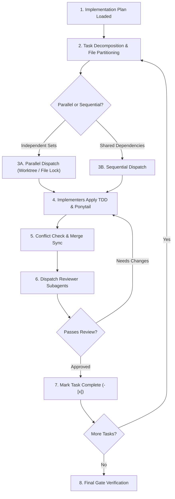

# 🤖 Agentic Workflow 02: Subagent-Driven Development & Parallel Dispatch

> **Purpose:** Execute complex software tasks by decomposing work into atomic tasks, enforcing file partition boundaries, resolving parallel merge conflicts, and orchestrating fresh subagents for implementation and code review.

---

## 📋 Prerequisites
- An approved implementation plan with atomic task decomposition (`workflows/12-implementation-planning-and-checklists.md`).
- A clean git working tree (`git status` reports zero unstaged or untracked changes).
- A passing baseline test suite.

---

## 🧭 Workflow State Machine

---

## Step-by-Step Execution

### Step 1: Context Isolation & File Partitioning
- The orchestrator agent maintains the high-level plan and task checklist.
- For each discrete task, spawn an isolated subagent so context remains clean and focused.
- **File Ownership Reservation:** Before dispatching subagents, assign an explicit whitelist of files to each subagent. No two concurrent subagents may be assigned write access to the same file.

### Step 2: Implementer Prompting Protocol
When delegating a task to an implementer subagent, supply:
1. **Target Task Description:** Exact goal and requirements.
2. **File Paths:** Explicit list of files to edit or create.
3. **Relevant Context:** Interfaces, type definitions, and reference patterns.
4. **Mandatory Rules:**
   - Follow Test-Driven Development (failing test first).
   - Apply Ponytail Ladder (shortest working diff, stdlib first).
   - Provide command execution evidence for every test run.

### Step 3: Implementer Execution Loop
The implementer subagent executes:
- **Red:** Writes failing test and runs it to confirm expected failure.
- **Green:** Implements minimal code to make tests pass.
- **Refactor:** Cleans code without adding unrequested features.
- **Self-Verification:** Runs the test suite and outputs exact pass count.

### Step 4: Conflict Resolution Protocol for Parallel Dispatch
When dispatching multiple subagents concurrently:
1. **Worktree Isolation:** Run parallel tasks in separate Git worktrees (`git worktree add -b feature-task-A ../task-A`).
2. **Overlap Pre-Check:** If two planned tasks must touch the same file, serialize them; do not run in parallel.
3. **Merge Synchronization:**
   - Subagent A commits and merges cleanly.
   - Subagent B rebases onto the new HEAD: `git rebase main`.
   - If git conflicts occur: The orchestrator halts subagent execution, inspects the 3-way diff (`git diff --check`), resolves conflict preferring non-breaking additive changes, and runs the combined test suite.
4. **State Convergence:** Once all branches merge into main, run the full test suite before marking tasks complete.

### Step 5: Reviewer Subagent Verification
Before accepting task output, dispatch a reviewer subagent:
- Reviews the `git diff` against specifications.
- Checks:
  - Did the implementer write tests first?
  - Are there any unrequested abstractions or speculative bloat?
  - Are type annotations and edge cases covered?
- Emits either `APPROVED` or actionable feedback list.

### Step 6: Final Verification Gate
Run full project test suite, linter, and build verification command (`python scripts/verify_evidence.py`) before presenting completion to the user.

---

## 🔗 Related Workflows
- **Prerequisite:** [Workflow 12: Implementation Planning & Checklists](12-implementation-planning-and-checklists.md)
- **Downstream:** [Workflow 06: Test-Driven Development](06-test-driven-development.md)
- **Downstream:** [Workflow 07: Autonomous Code Review](07-autonomous-code-review.md)
- **Failure Handling:** [Workflow 13: Error Recovery & Graceful Degradation](13-error-recovery-and-graceful-degradation.md)
- **Gate Enforcement:** [Workflow 10: Gate-Function Verification](10-gate-function-verification.md)
