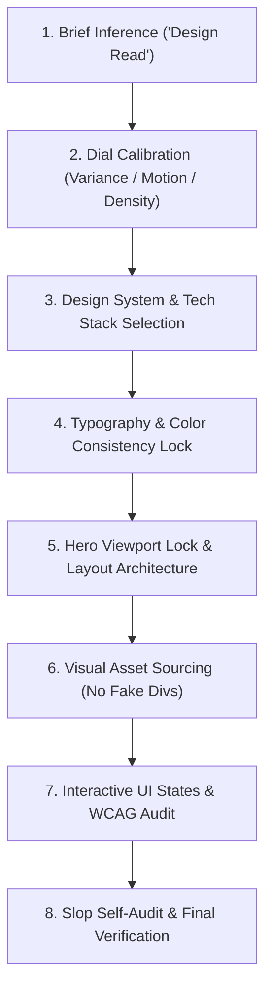

# 🎨 Agentic Workflow 03: Anti-Slop Frontend Design

> **Purpose:** Build distinctive, premium landing pages, portfolios, and web interfaces with zero generic AI slop.

---

## 📋 Prerequisites
- Clear target audience and user intent declared.
- Project design tokens or aesthetic style targets established (`workflows/08-design-dna-extraction.md`).
- Automated slop auditing script configured (`scripts/detect_ai_slop.py`).

---

## 🧭 Workflow State Machine

---

## Step-by-Step Execution

### Step 1: Brief Inference ("The Design Read")
Before touching code or styles, declare a one-line Design Read:
- **Format:** `"Reading this as: [Page Kind] for [Audience], with a [Vibe Language] visual feel, leaning toward [Design System / Aesthetic]."`
- Extract silent constraints (e.g. accessibility, enterprise compliance, mobile performance).

### Step 2: The Three Dials
Explicitly calibrate:
- `DESIGN_VARIANCE` (1–10): 5–6 for clean/minimalist SaaS; 7–8 for premium consumer; 9–10 for experimental/agency.
- `MOTION_INTENSITY` (1–10): 2–3 for corporate/regulated; 5–6 for standard SaaS; 8–10 for showcase sites.
- `VISUAL_DENSITY` (1–10): 2–3 for airy luxury; 4–5 for productivity tools; 7–9 for data consoles.

### Step 3: Typography & Color Lock
- **Font Selection:** Use modern sans fonts (Geist, Outfit, Cabinet Grotesk, Satoshi).
  - 🚫 *Banned as default:* Inter, Roboto, Arial.
  - 🚫 *Banned:* Random serif italic words in sans headlines.
- **Color Rules:**
  - 🚫 *The Lila Rule:* No default purple/blue glowing cards or AI neon buttons.
  - Max 1 accent color with saturation < 80%.
  - Neutral base (Zinc, Slate, or Stone).
  - Apply the **Color Consistency Lock**: The selected accent applies to the entire page.

### Step 4: Layout Architecture & Hero Hard Rules
- **Hero Viewport Lock:**
  - Must fit inside `min-h-[100dvh]` without scrolling on desktop.
  - Headline ≤ 2 lines, subtext ≤ 20 words, CTA visible above fold.
  - Top padding max `pt-24`.
  - Max 4 text elements in hero.
  - "Trusted by" logo wall belongs *under* the hero, never inside it.
- **Grid over Flex-Math:** Use CSS Grid for robust layouts.
- **Section Diversity:** Use at least 4 different layout families across 8 sections (bento, asymmetric split, full-width showcase, card matrix).

### Step 5: Visual Asset Strategy
- 🚫 **Div-based fake browser screenshots are strictly banned.**
- Use generated AI images, real Picsum seeded photos (`picsum.photos/seed/{slug}/{w}/{h}`), or SVG brand icons from Simple Icons (`cdn.simpleicons.org/{slug}`).

### Step 6: Interactive States & Contrast
- Implement Loading (skeletal), Empty, Error, and Tactile hover/active feedback.
- Every button must satisfy WCAG AA contrast (4.5:1 via `scripts/contrast_checker.py`).
- Button text must fit on one line at desktop (no wrapping).

### Step 7: Anti-Slop Self-Audit
Verify that the output passes automated checks:
- Run `python scripts/detect_ai_slop.py --strict`
- Run `python scripts/contrast_checker.py`
- Confirm: No Inter font default, no purple glow cards, no three identical equal-width cards, no white-on-white CTAs, responsive viewport heights (`100dvh`, never `h-screen`).

---

## 🔗 Related Workflows
- **Prerequisite:** [Workflow 08: Design DNA Extraction](08-design-dna-extraction.md)
- **Asset Generation:** [Workflow 09: Brand Asset Production](09-brand-asset-production.md)
- **Motion Integration:** [Workflow 04: Cinematic Motion Choreography](04-cinematic-motion-choreography.md)
- **Performance Profiling:** [Workflow 14: Performance Profiling & Optimization](14-performance-profiling-and-optimization.md)
- **Gate Enforcement:** [Workflow 10: Gate-Function Verification](10-gate-function-verification.md)
