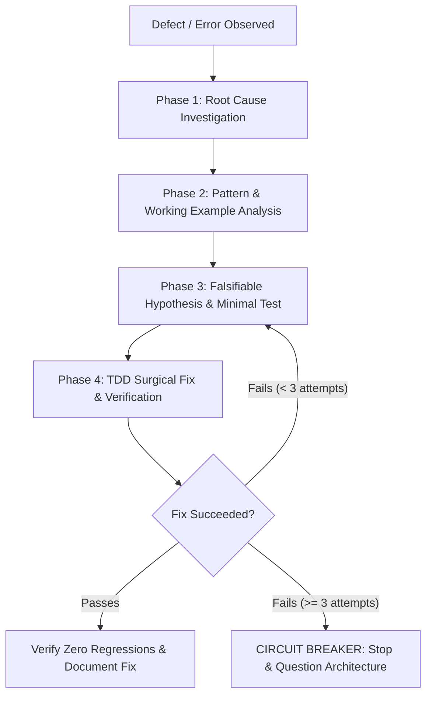

# 🔍 Agentic Workflow 05: Systematic Root-Cause Debugging

> **Purpose:** Resolve software defects by identifying and fixing root causes through an evidence-based 4-phase investigation protocol.

---

## 📋 Prerequisites
- A documented error trace, failing test output, or unexpected defect description.
- Access to the target codebase and terminal execution environment.
- Clean git status or checkpoint snapshot to revert experimental logging.

---

## 🧭 Workflow State Machine

---

## The Four Phases

### Phase 1: Root Cause Investigation
1. **Read full error traces:** Never skim or summarize stack traces. Identify the exact line, exception type, and stack frame.
2. **Reproduce consistently:** Create a minimal reproducible command or test case.
3. **Trace data flow:** Place boundary logs at inputs, state mutations, and outputs. Find where corrupt or invalid data originated.
4. **Inspect recent diffs:** Check `git diff` or recent commits for unexpected side effects.

### Phase 2: Pattern Analysis
1. Locate working examples of the same pattern within the current codebase.
2. Compare the broken path against the working path line-by-line.
3. Identify structural divergences in configuration, typing, or calling convention.

### Phase 3: Falsifiable Hypothesis
1. Formulate a single explicit hypothesis:
   - *"I hypothesize that the bug occurs because [Condition X] causes [Component Y] to receive [Value Z]."*
2. Design a minimal experiment that changes **only one variable** to test the hypothesis.

### Phase 4: Implementation & Circuit Breaker
1. **Write a failing test first:** The test must reproduce the exact bug before any fix is applied.
2. **Implement surgical fix:** Modify the code at the root cause, not where the symptom surfaces.
3. **Run test suite:** Confirm the test passes and no other tests broke.
4. 🛑 **The 3-Fix Circuit Breaker:**
   - If three fix attempts fail, **HALT IMMEDIATELY**.
   - Do not make a fourth attempt.
   - Stop, document findings, and invoke [Workflow 13: Error Recovery & Graceful Degradation](file:///d:/Agent%20SKILLS/ultra-skill/workflows/13-error-recovery-and-graceful-degradation.md).

---

## 🚫 Red Flag Rules
- ❌ *"Let's try changing X and see what happens"* → BANNED.
- ❌ Fixing symptoms by wrapping with try/except or adding null checks without understanding why the value is null.
- ❌ Proposing solutions before establishing reproducible evidence.

---

## 🔗 Related Workflows
- **Prerequisite / Trigger:** [Workflow 02: Subagent-Driven Development](file:///d:/Agent%20SKILLS/ultra-skill/workflows/02-subagent-driven-development.md)
- **Test Enforcement:** [Workflow 06: Test-Driven Development](file:///d:/Agent%20SKILLS/ultra-skill/workflows/06-test-driven-development.md)
- **Failure Escalation:** [Workflow 13: Error Recovery & Graceful Degradation](file:///d:/Agent%20SKILLS/ultra-skill/workflows/13-error-recovery-and-graceful-degradation.md)
- **Gate Enforcement:** [Workflow 10: Gate-Function Verification](file:///d:/Agent%20SKILLS/ultra-skill/workflows/10-gate-function-verification.md)
