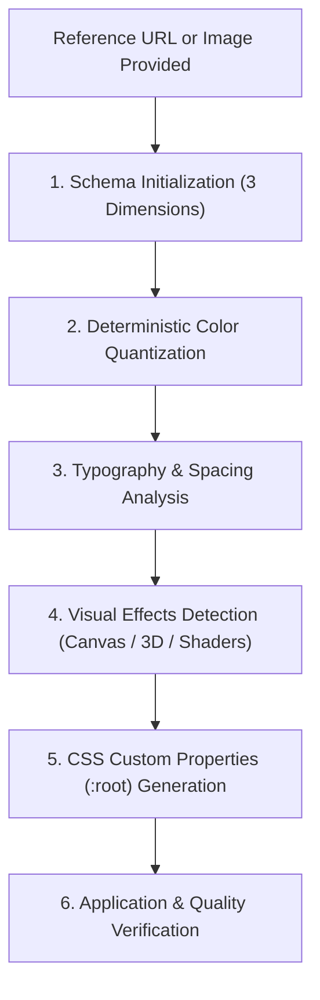

# 🧬 Agentic Workflow 08: Design DNA Extraction & Style Transfer

> **Purpose:** Extract, quantize, and apply design systems, typography, and visual effects from reference images or live URLs.

---

## 📋 Prerequisites
- A target reference design asset (high-resolution PNG/JPG, Figma mockup, or public URL).
- Browser inspection tools or image analysis capabilities.
- Target frontend stack identified (HTML/CSS, Tailwind, Next.js, Vite).

---

## 🧭 Workflow State Machine



---

## Step-by-Step Execution

### Step 1: Three-Dimensional Structure
Decompose the target design into three core dimensions:
1. **Design System (Tokens):** Primary, surface, text colors; font families, weights, scales; border radii; shadow elevations; spacing scales.
2. **Design Style (Perception):** Mood, visual language (e.g. Neo-brutalist, Minimalist luxury, Cyberpunk, Apple clean), brand tone, layout density.
3. **Visual Effects (Rendering):** Background gradients, noise textures, Canvas particles, WebGL shaders, Three.js 3D models.

### Step 2: Extraction & Quantization
- For images: Run color quantization script to find dominant hex values and contrast ratios.
- For live URLs: Inspect computed CSS styles to extract exact font families, line heights, and container widths.

### Step 3: CSS Token Architecture
Generate clean, standardized CSS custom properties:
```css
:root {
  /* Primitive Tokens */
  --dna-color-bg: #090a0f;
  --dna-color-surface: #141721;
  --dna-color-accent: #3b82f6;
  --dna-color-text: #f8fafc;
  --dna-color-muted: #94a3b8;

  /* Typography */
  --dna-font-display: 'Cabinet Grotesk', sans-serif;
  --dna-font-body: 'Geist', sans-serif;

  /* Shape & Elevation */
  --dna-radius-sm: 6px;
  --dna-radius-md: 12px;
  --dna-radius-lg: 20px;
  --dna-shadow-glow: 0 0 24px rgba(59, 130, 246, 0.15);
}
```

### Step 4: Token Application & Verification
- Apply the generated CSS tokens to semantic HTML structure.
- Verify WCAG contrast compliance for all text against backgrounds using `python scripts/contrast_checker.py`.
- Audit design against slop rules using `python scripts/detect_ai_slop.py`.

---

## 🔗 Related Workflows
- **Downstream Design:** [Workflow 03: Anti-Slop Frontend Design](03-anti-slop-frontend-design.md)
- **Asset Production:** [Workflow 09: Brand Asset Production](09-brand-asset-production.md)
- **Motion Design:** [Workflow 04: Cinematic Motion Choreography](04-cinematic-motion-choreography.md)
- **Gate Enforcement:** [Workflow 10: Gate-Function Verification](10-gate-function-verification.md)
