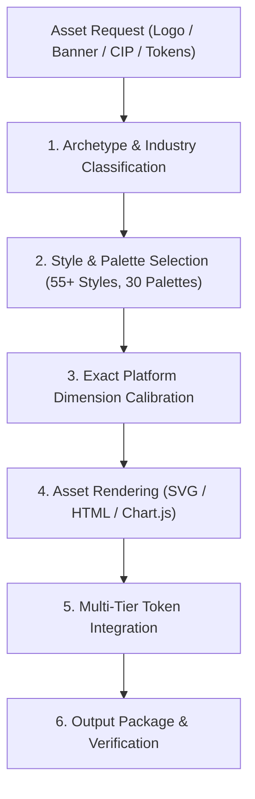

# 🛠️ Agentic Workflow 09: Brand Asset Production (UI/UX Pro Max)

> **Purpose:** Generate production-ready brand assets, corporate identity collateral, marketing banners, and multi-tier design tokens.

---

## 📋 Prerequisites
- Core brand archetype, industry vertical, and brand narrative established.
- Target marketing or platform channels identified (Social, Web, Pitch Deck, Mobile).
- Palette and aesthetic guidelines from [Workflow 08: Design DNA Extraction](08-design-dna-extraction.md).

---

## 🧭 Workflow State Machine



---

## Step-by-Step Execution

### Step 1: Asset Classification & Palette Selection
- Select from **55+ Logo Styles** (Monogram, Geometric, Minimal Line, Mascot, Abstract, Crest).
- Select from **30 Curated Color Palettes** (Nordic Calm, Electric Cyber, Swiss Modern, Earth Warm).

### Step 2: Multi-Platform Banner Dimension Calibration
Always use exact pixel dimensions for target social platforms:
- **Twitter / X Header:** 1500 × 500 px
- **LinkedIn Personal Banner:** 1584 × 396 px
- **YouTube Channel Banner:** 2560 × 1440 px
- **Instagram Story / Reel:** 1080 × 1920 px (9:16)
- **Instagram Square Post:** 1080 × 1080 px (1:1)
- **Google Ad Medium Rectangle:** 300 × 250 px

### Step 3: Three-Tier Design Token Architecture
Structure tokens hierarchically:
1. **Primitive Tokens (Raw Values):**
   ```css
   --color-indigo-600: #4f46e5;
   --color-slate-900: #0f172a;
   ```
2. **Semantic Tokens (Intent & Purpose):**
   ```css
   --color-primary: var(--color-indigo-600);
   --color-background: var(--color-slate-900);
   ```
3. **Component Tokens (Element Specific):**
   ```css
   --button-primary-bg: var(--color-primary);
   --card-header-color: var(--color-background);
   ```

### Step 4: HTML Slide Decks & Interactive Presentations
- Use semantic HTML with responsive flex/grid layouts.
- Integrate Chart.js via CDN for responsive data visualizations.
- Ensure all chart colors use semantic design tokens.

---

## 🔗 Related Workflows
- **Prerequisite:** [Workflow 08: Design DNA Extraction](08-design-dna-extraction.md)
- **Frontend Integration:** [Workflow 03: Anti-Slop Frontend Design](03-anti-slop-frontend-design.md)
- **Architecture Mockups:** [Workflow 11: Interactive Architecture Visualization](11-interactive-architecture-visualization.md)
- **Gate Enforcement:** [Workflow 10: Gate-Function Verification](10-gate-function-verification.md)
