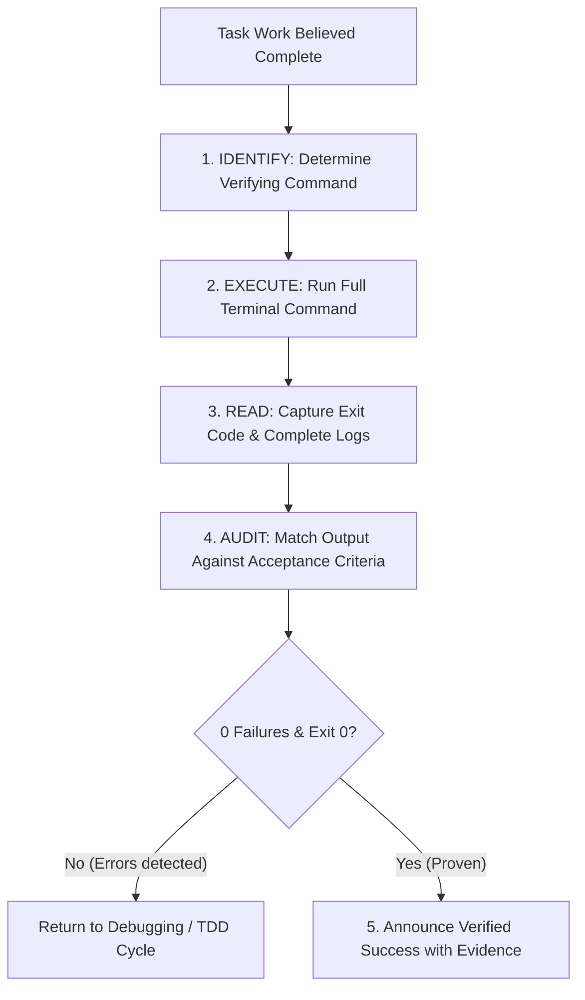

# 🛡️ Agentic Workflow 10: Gate-Function Verification Before Completion

> **Purpose:** Enforce evidence-based completion verification. Prohibit unverified claims of success.

---

## 📋 Prerequisites
- Implementation and review completed.
- Concrete terminal command capable of decisively proving success (`scripts/verify_evidence.py`).
- Clean repository workspace with no unstaged unwanted changes.

---

## 🧭 Workflow State Machine

---

## The 5-Step Gate Function Protocol

### 1. IDENTIFY
Determine the exact command that decisively proves the claim:
- *Tests pass?* → `pytest`, `npm test`, `cargo test`, `go test`.
- *Build succeeds?* → `npm run build`, `tsc --noEmit`, `python -m py_compile`.
- *Bug resolved?* → Run the specific reproduction script that previously failed.
- *Linter/Format clean?* → `eslint`, `ruff check`, `black --check`.
- *Automated Runner:* `python scripts/verify_evidence.py "<command>"`

### 2. EXECUTE
Run the complete, fresh command synchronously:
- Do not rely on previous executions.
- Do not rely on IDE background indicators.

### 3. READ
Inspect the full stdout/stderr:
- Verify exit code is strictly `0`.
- Verify total failure count is strictly `0`.
- Look for silent warnings or unhandled promise rejections.

### 4. AUDIT
Compare the execution results against all user requirements:
- Walk through the user's initial prompt point-by-point.
- Check off every requested feature.

### 5. ANNOUNCE
Only when steps 1–4 pass with zero errors, present the final output to the user:
- Quote the command executed.
- State the verified outcome with quantitative evidence (e.g., `"14 passed in 1.2s"`).

---

## 🚫 Prohibited Language
The agent MUST NEVER use these phrases without attached command evidence:
- *"This should fix the issue."*
- *"It should now pass all tests."*
- *"Everything seems to be working properly."*
- *"I believe the implementation is complete."*

---

## 🔗 Related Workflows
- **Triggering Workflows:** [Workflow 02: Subagent-Driven Development](02-subagent-driven-development.md), [Workflow 06: Test-Driven Development](06-test-driven-development.md)
- **Code Review Gate:** [Workflow 07: Autonomous Code Review](07-autonomous-code-review.md)
- **Failure Remediation:** [Workflow 05: Systematic Root Cause Debugging](05-systematic-root-cause-debugging.md), [Workflow 13: Error Recovery & Graceful Degradation](13-error-recovery-and-graceful-degradation.md)
- **Performance Gate:** [Workflow 14: Performance Profiling & Optimization](14-performance-profiling-and-optimization.md)
