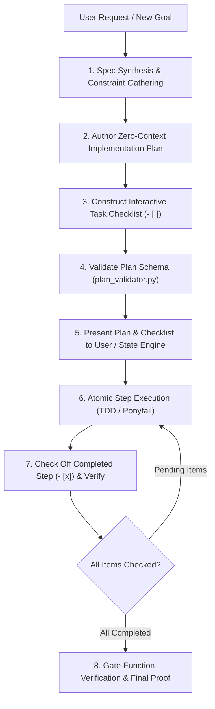

# 📋 Agentic Workflow 12: Implementation Planning & Progress Checklists

> **Iron Law:** NO PRODUCTION OR CODE CHANGES WITHOUT AN IMPLEMENTATION PLAN AND CHECKLIST FIRST.

---

## 📋 Prerequisites
- A clear user requirement, feature initiative, or refactoring objective.
- Access to the target codebase file tree and dependencies.
- Plan validation tool available (`python scripts/plan_validator.py`).

---

## 🧭 Workflow State Machine



---

## Mandatory Execution Protocol

Whenever a new plan or task starts:
1. **Halt Immediate Coding:** Do not start creating or modifying code files prematurely.
2. **Draft the Implementation Plan:** Document the architecture, constraints, affected files, and interfaces.
3. **Generate the Interactive Checklist:** Every task must feature checkable markdown checkboxes (`- [ ]`).
4. **Validate Schema:** Run `python scripts/plan_validator.py <path_to_plan>` to ensure compliance with the §11 specification schema and verify task count $\le 20$.
5. **Live Progress Tracking:** As each task step passes verification, update the checkbox to `- [x]`.

---

## Standard Implementation Plan & Checklist Template

When initiating a plan, output the following structured format:

```markdown
# 📋 [Feature / Task Name] Implementation Plan

**Goal:** [One clear sentence defining what is being delivered]
**Architecture & Strategy:** [2-3 sentences outlining the design, patterns, and modules]
**Tech Stack:** [Key technologies, frameworks, and libraries]
**Affected Files:**
- `path/to/source.py` (Create / Modify)
- `tests/test_source.py` (Test)

---

## 🎯 Global Constraints & Non-Negotiables
- [ ] Constraint 1 (e.g. YAGNI: No speculative abstractions)
- [ ] Constraint 2 (e.g. WCAG AA contrast compliance)
- [ ] Constraint 3 (e.g. 100% test coverage with zero regressions)

---

## 📝 Master Implementation Checklist

### Phase 1: Setup & Contracts
- [ ] Step 1.1: Verify environment and baseline test suite
- [ ] Step 1.2: Define data models and interface schemas

### Phase 2: Core Implementation (TDD)
- [ ] Step 2.1: Write failing tests for Component A (RED)
- [ ] Step 2.2: Implement minimal code for Component A (GREEN)
- [ ] Step 2.3: Refactor Component A and verify passing tests
- [ ] Step 2.4: Write failing tests for Component B (RED)
- [ ] Step 2.5: Implement minimal code for Component B (GREEN)

### Phase 3: Integration & Self-Correction
- [ ] Step 3.1: Connect components and test end-to-end flow
- [ ] Step 3.2: Run autonomous code review and static security scan
- [ ] Step 3.3: Resolve all critical and major findings

### Phase 4: Final Verification Gate
- [ ] Step 4.1: Execute full test suite command with exit code 0
- [ ] Step 4.2: Audit all deliverables point-by-point against acceptance criteria
- [ ] Step 4.3: Generate completion summary and verification receipt
```

---

## Real-Time Tracking Rules

- **Atomic Checkboxes:** Each checklist item must represent a single, checkable action with a definite pass/fail outcome.
- **Never Check Ahead:** Only mark `- [x]` AFTER the verifying command has run and confirmed success with evidence.
- **Decomposition Ceiling:** Never exceed 20 tasks in a single checklist. When scope exceeds 20 items, decompose into sub-plans.
- **Circuit Breaker:** If an item fails 3 consecutive times, stop execution and consult the user before modifying the plan.

---

## 🔗 Related Workflows
- **Downstream Execution:** [Workflow 02: Subagent-Driven Development](file:///d:/Agent%20SKILLS/ultra-skill/workflows/02-subagent-driven-development.md)
- **TDD Implementation:** [Workflow 06: Test-Driven Development](file:///d:/Agent%20SKILLS/ultra-skill/workflows/06-test-driven-development.md)
- **Architecture Visualization:** [Workflow 11: Interactive Architecture Visualization](file:///d:/Agent%20SKILLS/ultra-skill/workflows/11-interactive-architecture-visualization.md)
- **Error Recovery:** [Workflow 13: Error Recovery & Graceful Degradation](file:///d:/Agent%20SKILLS/ultra-skill/workflows/13-error-recovery-and-graceful-degradation.md)
- **Final Gate Enforcement:** [Workflow 10: Gate-Function Verification](file:///d:/Agent%20SKILLS/ultra-skill/workflows/10-gate-function-verification.md)
