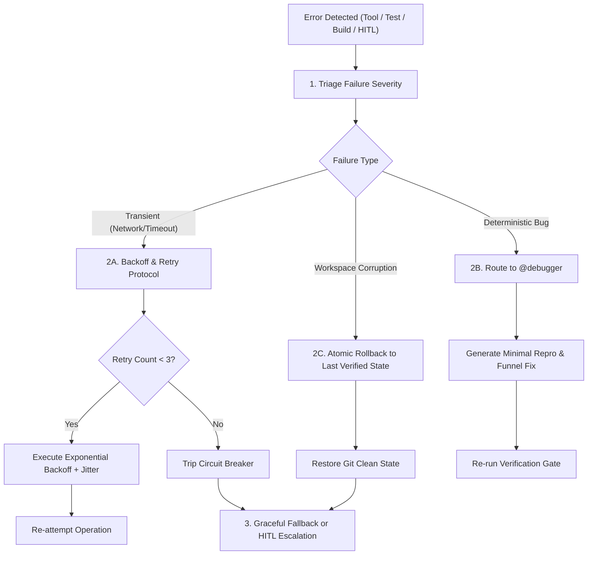

# 🛡️ Agentic Workflow 13: Error Recovery & Graceful Degradation

> **Purpose:** Provide an automated, resilient protocol for handling agent execution failures, tool timeouts, broken builds, test regressions, and corrupted workspaces without context collapse or data loss.

---

## 📋 Prerequisites
- Git-tracked repository or checkpoint snapshot mechanism.
- Structured event logging or terminal output capturing execution status.
- Defined gate functions (`python scripts/verify_evidence.py`).

---

## 🧭 Workflow State Machine



---

## Step-by-Step Execution

### Step 1: Failure Classification & Triage
When an operation fails or exits with a non-zero code, immediately classify the failure category:
1. **Tier 1: Transient Failures**
   - *Symptoms:* Network socket timeout, rate-limiting HTTP 429, temporary lock contention.
   - *Action:* Execute Exponential Backoff and Jitter.
2. **Tier 2: Deterministic Logic / Test Failures**
   - *Symptoms:* Assertion failure in unit tests, compilation error, syntax error.
   - *Action:* Route directly to `@debugger` for Root Cause Analysis (RCA); do not retry blindly.
3. **Tier 3: Workspace / State Corruption**
   - *Symptoms:* Merge conflict debris (`<<<<<<< HEAD`), partially deleted files, unparseable lockfiles.
   - *Action:* Execute Atomic State Rollback.

### Step 2: Resilient Retry & Circuit Breaker Protocol
For Tier 1 transient failures:
- Compute delay using exponential backoff with full jitter:
  $$t = \min\left(t_{\max},\; t_0 \times 2^{\text{attempt}} \pm \text{random}(0, 0.5 \times t_0)\right)$$
- If the tool fails **3 consecutive times**:
  - Trip the circuit breaker.
  - Halt automated retries on that tool/endpoint.
  - Log a structured error event into session trace.

### Step 3: Atomic Workspace Rollback
If a subagent leaves the workspace in a broken or non-compiling state:
1. **Inspect Damage:** Run `git status --porcelain` and `git diff --stat`.
2. **Preserve Diagnostic Artifact:** Save the error output and diff to `.archify/failed_attempt_<timestamp>.patch`.
3. **Revert Workspace:**
   ```bash
   git checkout -- .
   git clean -fd
   ```
4. **Restore to Last Verified Receipt:** Verify that `.verification/last_known_good.json` state is restored and tests pass again.

### Step 4: Graceful Degradation Strategies
When primary tools or advanced features fail and cannot be retried:
- **Headless Browser Failure:** Fall back to direct DOM/HTML static parsing or HTTP response inspection.
- **Complex Animation / 3D Canvas Crash:** Fall back to clean CSS transitions or static SVG layout.
- **External API Down:** Switch to mock fixture responses or local JSON cache.
- **Dynamic Bundler Failure:** Fall back to vanilla ESM scripts without bundling step.

### Step 5: Structured Human-In-The-Loop (HITL) Escalation
If automated recovery fails:
- Present a structured escalation report to the user:
  1. **What was attempted:** Target goal and specific subagent command.
  2. **What failed:** Exact error message and exit code.
  3. **What was rolled back:** Confirming the workspace is clean.
  4. **Available Recovery Options:** Provide 2-3 concrete paths forward (e.g. skip optional dependency, alter configuration, adjust requirements).

---

## 🔗 Related Workflows
- **Prerequisite:** [Workflow 01: Agent Graph Orchestration](file:///d:/Agent%20SKILLS/ultra-skill/workflows/01-agent-graph-orchestration.md)
- **Investigation:** [Workflow 05: Systematic Root Cause Debugging](file:///d:/Agent%20SKILLS/ultra-skill/workflows/05-systematic-root-cause-debugging.md)
- **Verification:** [Workflow 10: Gate-Function Verification](file:///d:/Agent%20SKILLS/ultra-skill/workflows/10-gate-function-verification.md)
- **Planning:** [Workflow 12: Implementation Planning & Checklists](file:///d:/Agent%20SKILLS/ultra-skill/workflows/12-implementation-planning-and-checklists.md)
