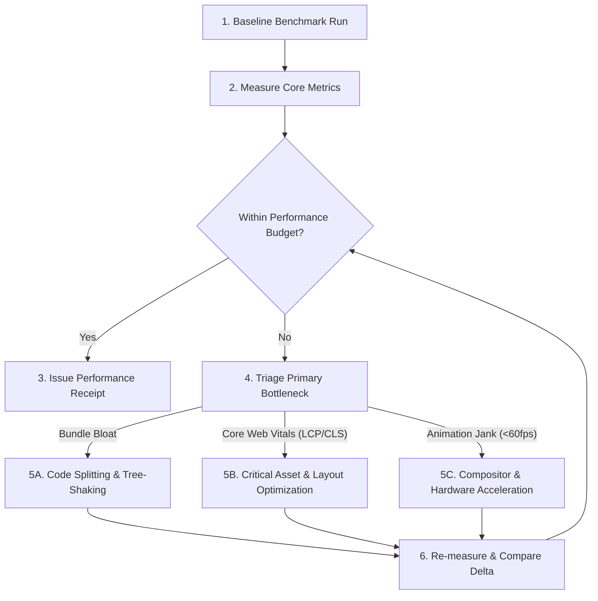

# ⚡ Agentic Workflow 14: Performance Profiling & Optimization

> **Purpose:** Systematically audit, measure, and optimize application performance across Core Web Vitals, bundle size footprints, rendering frame budgets, and network latency thresholds.

---

## 📋 Prerequisites
- A functional production build or live local staging server.
- Performance auditing tools available (`lighthouse`, `bundlesize`, or Chrome DevTools protocol).
- Defined performance budgets (e.g., initial JS $\le 150\text{KB}$ gzipped, 60fps animations).

---

## 🧭 Workflow State Machine

---

## Step-by-Step Execution

### Step 1: Core Web Vitals Benchmarking
Execute an automated audit against Google Core Web Vitals targets:
- **Largest Contentful Paint (LCP):** Must complete in $\le 2.5\text{s}$ on mobile 4G throttling.
- **Interaction to Next Paint (INP):** Must remain $\le 200\text{ms}$ under user interaction.
- **Cumulative Layout Shift (CLS):** Must remain $\le 0.1$ across dynamic data loads.
- **First Contentful Paint (FCP):** Target $\le 1.8\text{s}$.

### Step 2: Bundle Size & Tree-Shaking Audit
1. Run bundler visualizer (`npx vite-bundle-visualizer` or `webpack-bundle-analyzer`).
2. Identify duplicate libraries, oversized transitive packages, or missing tree-shaking exports.
3. Enforce bundle budgets:
   - Initial critical JS bundle: $\le 150\text{KB}$ (gzip).
   - Critical CSS: $\le 25\text{KB}$ (inline or preloaded).
4. Apply dynamic dynamic imports (`React.lazy()`, `import()`) for non-critical route chunks.

### Step 3: Runtime Frame Rate & Rendering Profiling
1. Measure rendering frame times during scroll and transition events.
2. Verify frame time budget: $\le 16.67\text{ms}$ per frame (60fps) or $\le 8.33\text{ms}$ (120fps).
3. Check for layout thrashing:
   - Ban reads of layout properties (`offsetWidth`, `getBoundingClientRect`) immediately followed by writes in animation loops.
   - Restrict animations strictly to `transform` and `opacity`.

### Step 4: Asset & Image Optimization Pipeline
- Convert hero and content images to next-gen formats (**WebP** or **AVIF**).
- Enforce explicit `width` and `height` attributes on all `` tags to prevent layout shifts.
- Apply native lazy loading (`loading="lazy"`) and asynchronous decoding (`decoding="async"`) to below-the-fold media.
- Inline critical SVGs and prefetch fonts using `<link rel="preload" as="font" crossorigin>`.

### Step 5: Regression Guard & Certification
1. Compare new metrics against baseline receipt:
   - Bundle size delta must be $\le 0$ or explicitly justified.
   - Core Web Vitals scores must not regress.
2. Archive performance certification into `.verification/receipt-perf.json`.

---

## 🔗 Related Workflows
- **Prerequisite:** [Workflow 03: Anti-Slop Frontend Design](file:///d:/Agent%20SKILLS/ultra-skill/workflows/03-anti-slop-frontend-design.md)
- **Motion Optimization:** [Workflow 04: Cinematic Motion Choreography](file:///d:/Agent%20SKILLS/ultra-skill/workflows/04-cinematic-motion-choreography.md)
- **Gate Enforcement:** [Workflow 10: Gate-Function Verification](file:///d:/Agent%20SKILLS/ultra-skill/workflows/10-gate-function-verification.md)
- **Error Recovery:** [Workflow 13: Error Recovery & Graceful Degradation](file:///d:/Agent%20SKILLS/ultra-skill/workflows/13-error-recovery-and-graceful-degradation.md)
