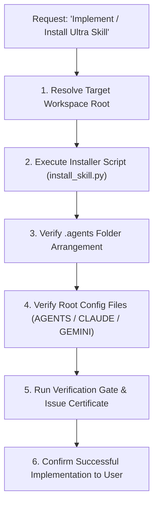

# 🚀 Agentic Workflow 15: Skill Implementation & Proper `.agents` Folder Arrangement

> **Purpose:** Standardize the installation, deployment, and file arrangement of Ultra Skill into any user project or repository, ensuring all skill bundles, subagent personas, and configuration files are properly placed within the `.agents/` directory tree.

---

## 📋 Prerequisites
- A target repository or project workspace root identified.
- Python 3.10+ runtime available.
- Ultra Skill source repository or package available.

---

## 🧭 Canonical Workspace Directory Topology

Whenever Ultra Skill is implemented in a project, it **MUST** be arranged strictly according to this structure:

```text
<project-root>/
├── .agents/
│   ├── skills/
│   │   └── ultra-skill/               # Self-contained skill engine
│   │       ├── SKILL.md               # Master skill definition & YAML frontmatter
│   │       ├── agents/                # Bundled subagent persona specs
│   │       ├── workflows/             # All 15 executable workflows
│   │       ├── scripts/               # Automated quality & verification tools
│   │       └── references/            # Upstream reference archives & catalogs
│   ├── agents/                        # Top-level personas for direct IDE discovery
│   │   ├── planner.md                 # @planner: Implementation plans & checklists
│   │   ├── architect.md               # @architect: ADK 2.0 graphs & resilience
│   │   ├── visualizer.md              # @visualizer: Archify interactive diagrams
│   │   ├── engineer.md                # @engineer: Ponytail minimal diffs
│   │   ├── designer.md                # @designer: Taste anti-slop frontend
│   │   ├── animator.md                # @animator: GSAP 60fps frame budgets
│   │   ├── debugger.md                # @debugger: 4-phase root cause analysis
│   │   ├── tester.md                  # @tester: Red-Green-Refactor TDD
│   │   ├── reviewer.md                # @reviewer: CodeRabbit security & audits
│   │   └── verifier.md                # @verifier: Gate verification receipts
│   └── rules/                         # Customization rules
│       └── AGENTS.md                  # State machine & behavioral rules
├── AGENTS.md                          # Root agent configuration pointer
├── CLAUDE.md                          # Claude Code entrypoint
├── GEMINI.md                          # Gemini CLI / Antigravity entrypoint
└── .slopignore                        # Anti-slop whitelist configuration
```

---

## 🧭 Workflow State Machine



---

## Step-by-Step Execution

### Step 1: Resolve Target Workspace Root
Determine whether the installation is:
- **Workspace-level (Recommended):** Targets the current project repository (`<target_root>/.agents/`).
- **Global-level:** Targets user global configuration (`~/.gemini/config` or `~/.agents`).

### Step 2: Execute Automated Installer
Run the automated arrangement tool from the Ultra Skill source:
```bash
python scripts/install_skill.py <path_to_target_project>
```
To overwrite pre-existing templates, append `--force`:
```bash
python scripts/install_skill.py <path_to_target_project> --force
```

### Step 3: Verify Subagent & Skill Boundaries
Verify that files are not dumped loosely into the project root:
- [ ] `.agents/skills/ultra-skill/SKILL.md` exists and contains valid metadata.
- [ ] `.agents/skills/ultra-skill/workflows/` contains all 15 workflows.
- [ ] `.agents/skills/ultra-skill/scripts/` contains all quality scripts.
- [ ] `.agents/agents/` contains all 10 subagent personas.
- [ ] `.agents/rules/AGENTS.md` exists.

### Step 4: Verify Root Entrypoints
Confirm the four root integration files are in place:
1. `AGENTS.md`: Directs IDE agents through the 6-phase state machine.
2. `CLAUDE.md`: Configures Claude Code skill loading.
3. `GEMINI.md`: Configures Gemini CLI / Google Antigravity discovery.
4. `.slopignore`: Prevents false positives in third-party vendor directories.

### Step 5: Execute Installation Verification Gate
Run a verification command in the target project to confirm installation integrity:
```bash
python .agents/skills/ultra-skill/scripts/verify_evidence.py "python .agents/skills/ultra-skill/scripts/detect_ai_slop.py --help"
```

---

## 🔗 Related Workflows
- **Prerequisite / Routing:** [Workflow 01: Agent Graph Orchestration](file:///d:/Agent%20SKILLS/ultra-skill/workflows/01-agent-graph-orchestration.md)
- **Subagent Dev:** [Workflow 02: Subagent-Driven Development](file:///d:/Agent%20SKILLS/ultra-skill/workflows/02-subagent-driven-development.md)
- **Gate Enforcement:** [Workflow 10: Gate-Function Verification](file:///d:/Agent%20SKILLS/ultra-skill/workflows/10-gate-function-verification.md)
