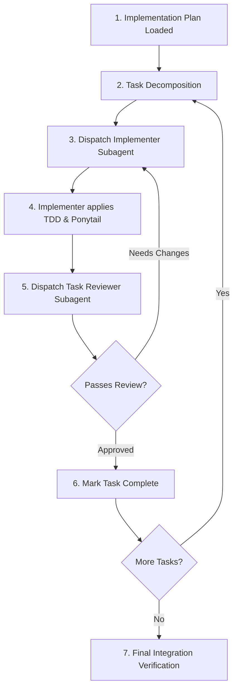

# 🤖 Agentic Workflow 02: Subagent-Driven Development & Parallel Dispatch

> **Purpose:** Execute complex software tasks by decomposing work into atomic tasks and orchestrating fresh subagents for implementation and code review.

---

## 🧭 Workflow State Machine

---

## Step-by-Step Execution

### Step 1: Context Isolation
- The orchestrator agent maintains the high-level plan and task checklist.
- For each discrete task, spawn an isolated subagent so context remains clean and focused.

### Step 2: Implementer Prompting Protocol
When delegating a task to an implementer subagent, supply:
1. **Target Task Description:** Exact goal and requirements.
2. **File Paths:** Explicit list of files to edit or create.
3. **Relevant Context:** Interfaces, type definitions, and reference patterns.
4. **Mandatory Rules:**
   - Follow Test-Driven Development (failing test first).
   - Apply Ponytail Ladder (shortest working diff, stdlib first).
   - Provide command execution evidence for every test run.

### Step 3: Implementer Execution Loop
The implementer subagent executes:
- **Red:** Writes failing test and runs it to confirm expected failure.
- **Green:** Implements minimal code to make tests pass.
- **Refactor:** Cleans code without adding unrequested features.
- **Self-Verification:** Runs the test suite and outputs exact pass count.

### Step 4: Reviewer Subagent Verification
Before accepting the task output, dispatch a reviewer subagent:
- Reviews the `git diff` against specifications.
- Checks:
  - Did the implementer write tests first?
  - Are there any unrequested abstractions or speculative bloat?
  - Are type annotations and edge cases covered?
- Emits either `APPROVED` or actionable feedback list.

### Step 5: Parallel Dispatch (When Tasks Are Independent)
- If multiple tasks touch completely disjoint files/modules:
  - Spawn parallel subagents simultaneously.
  - Require each subagent to run its local tests.
  - Converge results and run the global test suite once merged.

### Step 6: Final Verification Gate
Run full project test suite and build verification command before presenting completion to the user.
