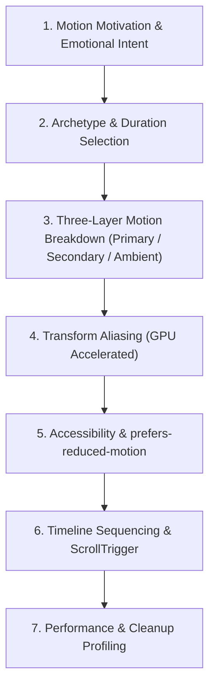

# 🎬 Agentic Workflow 04: Cinematic Motion Choreography & Animation

> **Purpose:** Implement 60fps, responsive, and emotionally resonant animations using GSAP and Motion Design principles.

---

## 🧭 Workflow State Machine



---

## Step-by-Step Execution

### Step 1: Motion Motivation
- State the motivation for each animated element: *"What does this animation communicate to the user?"*
- Never animate for decoration alone. Motion must indicate hierarchy, state transitions, or continuity.

### Step 2: Pick Motion Archetype & Easing Curves
Select **ONE** personality archetype per project:
- **Playful:** 150–300ms, `ease-out-back`, 10–20% overshoot.
- **Premium:** 350–600ms, `cubic-bezier(0.4, 0, 0.2, 1)`, 0% overshoot.
- **Corporate:** 200–400ms, `cubic-bezier(0.2, 0, 0, 1)`, 0–3% overshoot.
- **Energetic:** 100–250ms, `ease-out-expo`, 15–30% overshoot.

*Rule:* Spatial movement must **never** be linear. Always use easing curves (ease-out for entrances, ease-in for exits).

### Step 3: Establish the Three Motion Layers
Every animated view must have three distinct layers:
1. **Primary Layer:** The main subject being revealed (hero card, headline).
2. **Secondary Layer:** Accompanying reactions (subtle card shadow expansion, badge drift).
3. **Ambient Layer:** Environmental life (very slow background gradient oscillation, subtle floating glow).

### Step 4: GPU Transform Aliases
Only animate transform and opacity properties:
- GSAP aliases: `x`, `y`, `scale`, `rotation`, and `autoAlpha` (which sets `visibility: hidden` at 0).
- 🚫 **Never animate layout properties** like `top`, `left`, `width`, or `height`.

### Step 5: Responsive & Accessible MatchMedia
Always wrap GSAP animations with `gsap.matchMedia()`:
```javascript
const mm = gsap.matchMedia();

mm.add({
  isDesktop: "(min-width: 800px)",
  reduceMotion: "(prefers-reduced-motion: reduce)",
}, (context) => {
  const { isDesktop, reduceMotion } = context.conditions;

  if (reduceMotion) {
    gsap.set(".reveal-item", { autoAlpha: 1 });
    return;
  }

  gsap.from(".reveal-item", {
    y: isDesktop ? 40 : 20,
    autoAlpha: 0,
    duration: 0.5,
    stagger: 0.1,
    ease: "power2.out",
  });
});
```

### Step 6: ScrollTrigger Best Practices
- Never use `window.addEventListener('scroll')`. Always use ScrollTrigger or Motion `whileInView`.
- Use pinned scrub timelines for sticky stacks and horizontal pans.
- In React/Vue/Svelte, always clean up timelines in component unmount lifecycles (`context.revert()`).
