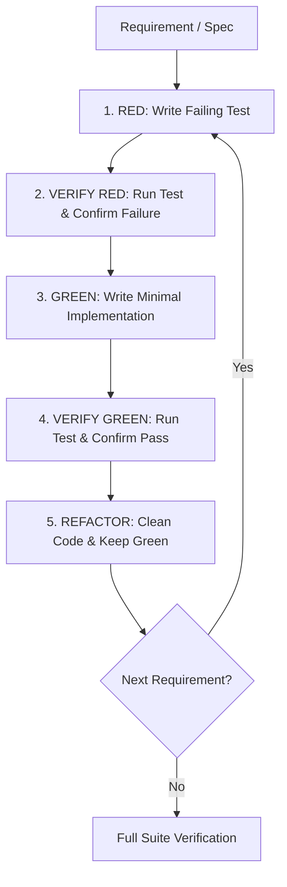

# 🧪 Agentic Workflow 06: Test-Driven Development (TDD)

> **Purpose:** Enforce ironclad Red-Green-Refactor discipline. No production code is written without a failing test first.

---

## 🧭 Workflow State Machine



---

## Step-by-Step Execution

### Step 1: Write Atomic Failing Test (RED)
- Write a single unit or integration test representing one atomic requirement.
- Test against real code where possible (avoid artificial mocks unless testing external I/O or network calls).
- Name the test clearly following the `test_[scenario]_[expected_outcome]` convention.

### Step 2: Verify RED State
- Run the test suite:
  ```bash
  pytest tests/test_feature.py
  # or
  npm test
  ```
- **Inspect failure message:** Confirm the test fails for the *expected reason* (e.g. missing function or incorrect return value), not because of syntax or import errors.

### Step 3: Implement Minimal Solution (GREEN)
- Apply the **Ponytail Principle**: Write the simplest code that allows the test to pass.
- Do not add unrequested helper methods, speculative abstractions, or future-proofing logic.

### Step 4: Verify GREEN State
- Re-run the test command.
- Confirm that the new test passes and all pre-existing tests remain green (0 failures).

### Step 5: Refactor
- Remove duplication.
- Improve naming and readability.
- Re-run tests after refactoring to ensure no regressions were introduced.

---

## ⚖️ The Iron Rules of TDD
1. Production code written before tests must be deleted.
2. "I will write tests after" is strictly prohibited. Tests written after implementation pass immediately and prove nothing about the test's validity.
