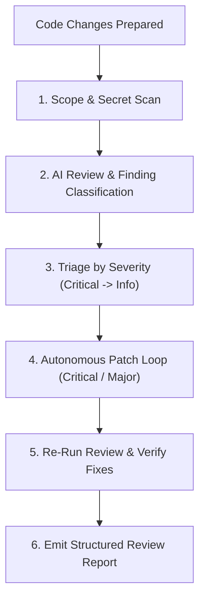

# 🐇 Agentic Workflow 07: Autonomous Code Review & Security Audit

> **Purpose:** Run comprehensive, severity-ranked code reviews to catch bugs, performance bottlenecks, and security vulnerabilities before merging.

---

## 🧭 Workflow State Machine



---

## Step-by-Step Execution

### Step 1: Scope & Secret Scan
Before reviewing code, verify that no sensitive tokens or secrets are exposed in the diff:
- Check for `.env`, API keys, private keys, authentication bearer tokens.
- Review scope: `git diff HEAD~1` (commits) or `git diff` (working tree).

### Step 2: Severity Classification
Every finding must be assigned an explicit severity:
- 🔴 **CRITICAL:** Remote code execution, SQL/command injection, data loss, credential leaks, authentication bypass.
- 🟠 **MAJOR:** Logic errors affecting primary functionality, unhandled exceptions in core workflows, severe performance regressions (e.g. N+1 queries).
- 🟡 **MINOR:** Edge-case handling gaps, missing validation, inefficient algorithms, code duplication.
- 🟢 **TRIVIAL / INFO:** Style inconsistencies, naming conventions, minor documentation typos.

### Step 3: Autonomous Autofix Loop
For all **Critical** and **Major** findings:
1. Create a task list of actionable defects.
2. For each defect, apply a surgical fix following the Ponytail principle.
3. Run the project test suite to verify the fix does not introduce regressions.

### Step 4: Verification & Final Report
Re-run the review on the updated diff and output a structured report:
```markdown
### Code Review Summary
- **Critical Issues:** 0 (Resolved)
- **Major Issues:** 0 (Resolved)
- **Minor Issues:** 2 (Non-blocking)
- **Status:** APPROVED / READY FOR MERGE
```
