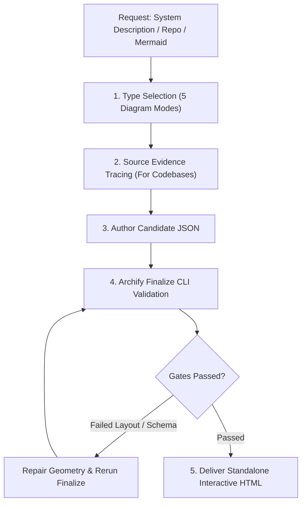

# 🗺️ Agentic Workflow 11: Interactive Architecture Visualization (Archify)

> **Purpose:** Turn system descriptions, codebases, and Mermaid diagrams into interactive standalone HTML diagrams with inline SVG, dark/light themes, and export capabilities.

---

## 🧭 Workflow State Machine



---

## Step-by-Step Execution

### Step 1: Type Selection
Classify the visual intent into one of the 5 Archify types:
- **`architecture`**: Components, services, containers, databases, cloud & security boundaries.
- **`workflow`**: Step-by-step processes, approval gates, agent tool execution paths, CI/CD runbooks.
- **`sequence`**: API call chains, request/response lifecycles, async message traces between participants.
- **`dataflow`**: Pipelines, ETL/ELT flows, data lineage, producer-consumer networks.
- **`lifecycle`**: State machines, lifecycle transitions, retry states, terminal outcomes.

### Step 2: Mermaid Conversion (If User Provided Mermaid)
- `flowchart` / `graph` → `workflow` (or `architecture` for infrastructure).
- `sequenceDiagram` → `sequence` (messages, async replies, participants).
- `stateDiagram` → `lifecycle` (states, transitions, guard conditions).
*Extract semantics and topology; do not mechanically copy Mermaid's flat styling.*

### Step 3: Author Candidate JSON
Create `.archify/<type>-<slug>-<timestamp>/candidate.json`:
- Structure nodes with clear labels, semantic icons, and boundary groupings.
- Link relationships with explicit directional flows (`from` → `to`).
- Set `meta.quality_profile` to `"showcase"`.
- For real codebases, attach source evidence pointers (`file` and line references).

### Step 4: Finalize CLI Validation
Run the Archify validation and packaging command:
```bash
node skills/ultra-skill/references/archify/bin/archify.mjs finalize <type> <candidate.json> <output.html> --quality showcase --json
```

### Step 5: Verification Gate & Delivery
- Confirm exit code `0`.
- The generated `<output.html>` is completely self-contained with:
  - Dark/Light theme toggle
  - Pan & zoom controls
  - Interactive click-to-highlight node connectivity
  - Export to SVG, PNG, WebP, and WebM
